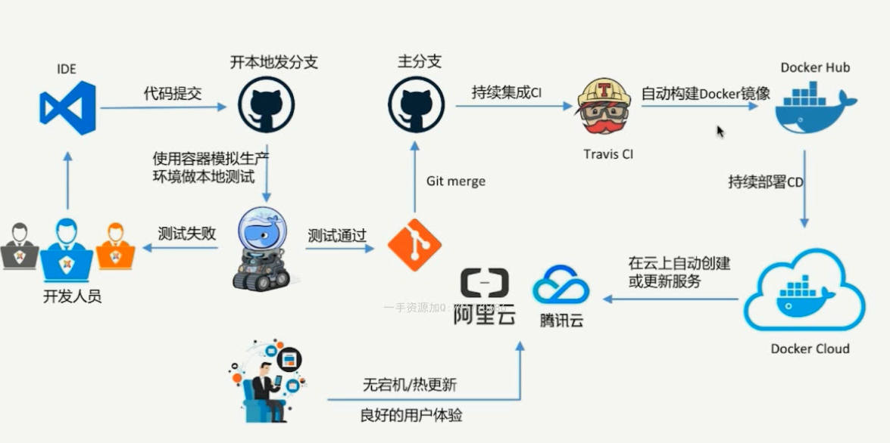
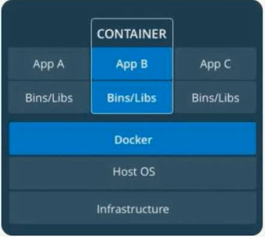
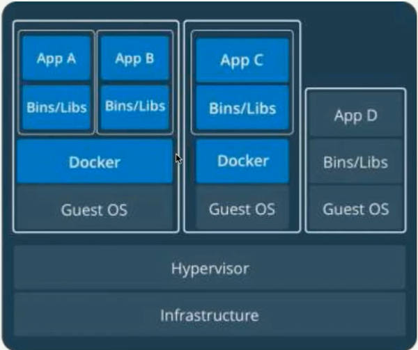

# Container Introduction

- [Container Introduction](#container-introduction)
  - [Docker installation](#docker-installation)
  - [Image](#image)
  - [Container](#container)
    - [Create image](#create-image)

> 

容器的意义: 解决了开发和运维之间的沟通问题, container是一个标准, 类似集装箱

容器定义:
- 对软件和其依赖的标准化打包
- 应用之间相互隔离
- 共享一个os kernel
- 可以运行在多种OS上面

容器 vs 虚拟化
> 
> 
- 容器是APP层面的隔离
- 虚拟化是物理资源层面的隔离

虚拟化+容器:
> 

## Docker installation

check version:
- `docker --version`
- `sudo docker version`: more detail infomation

tip: 快速在virtualbox中创建inux虚拟机(需要提前安装好virtualbox)，采用[Vagrant](https://www.vagrantup.com/downloads.html)
- `vagrant --help`
- `vagrant init centos/7`: 会创建vagrantfile, 也可以google搜索vagrantfile for ubuntu18.04, 放到该目录
- `vagrant up`
- `vagrant ssh`: 直接进入了centos7的命令行
- `sudo yum update`
- `exit`
- `vagrant status`
- `vagrant halt`: power off centos
- `vagrant destroy`: delete centos

install docker in ubuntu
- `sudo apt-get remove docker docker-engine docker.io`
- `curl -fsSL https://download.docker.com/linux/ubuntu/gpg | sudo apt-key add -`
- `sudo add-apt-repository    "deb [arch=amd64] https://mirrors.tuna.tsinghua.edu.cn/docker-ce/linux/ubuntu \`
- `sudo apt-get install docker-ce`
- `sudo systemctl start docker`
- `sudo systemctl enable docker`
- `docker -v`
- `sudo docker info`
- `sudo docker images`
- `cd /etc/docker/`
- `sudo vim /etc/docker/daemon.json`
- `sudo systemctl restart docker`
- `sudo docker pull scrapinghub/splash`
- `sudo docker images`
- `sudo docker run -p 8050:8050 scrapinghub/splash`


```json
// /etc/docker/daemon.json
{
  "registry-mirrors": ["https://9cpn8tt6.mirror.aliyuncs.com"]
}
```

tip: 将上面命令写入vagrantfile可以自动安装完linux之后再安装docker

docker-machine: 一般docker for windows中自带有
- `docker-machine create demo`: 创建带docker的linux虚拟机(virtualbox提前安装)
- `docker-machine ls`: 列举virtualbox中的虚拟机
- `docker-machine ssh demo`: 进入linux
- `docker-machine stop demo`: power off linux
- `docker-machine start demo`: power on linux
- `docker-machine rm demo`: delete linux

tip1: 直接在远程运行docker
- `docker-machine start demo`
- `docker-machine ssh demo`
- `docker version`

tip2: 将远程的env弄到本地，然后本地的docker连接到远程的docker server
- `docker-machine env demo`
- `eval $(docker-machine env demo)`
- `docker version`

docker-machine在阿里云(余额>100)上面创建一个虚拟机然后再创建一个docker, [tutorial](https://github.com/AliyunContainerService/docker-machine-driver-aliyunecs)
- `docker-machine create -d aliyunecs --aliyunecs-access-key-id=<Your access key ID for the Aliyun ECS API> --aliyunecs-access-key-secret=<Your secret access key for the Aliyun ECS API>  --aliyunecs-region=<Region> demo`
- `docker-machine ls`
- `docker-machine ssh demo`: 进入远程界面
- `docker version`
- `exit`: 回到本地
- `docker-machine env demo`
- `eval $(docker-machine env demo)`: 本地管理远程的docker
- `docker version`
- `docker-machine env --unset`: 回到本地的env
- `docker version`

train docker: [docker playground](https://labs.play-with-docker.com/)

## Image

获取Image的方式
1. 通过Dockerfile来build
  - `more Dockerfile`
  - `sudo docker buiold -t alphagrey/redis:latest .`
  - `sudo docker images`

  ```docker
  FROM ubuntu:18.04
  LABEL maintainer="grey <grey@gmail.com>"
  RUN apt update && apt install -y redis-server
  EXPOSE 6379
  ENTRYPOINT ["/usr/bin/redis-server"]
  ```

  ```bash
  REPOSITORY  TAG IMAGE ID  CREATED SIZE
  alphagrey/redis latest  ada04644f1bb  23 minutes ago  97.1MB
  ubuntu  18.04 2eb2d388e1a2  13 days ago 64.2MB
  ```
2. 通过[DockerHub](https://hub.docker.com/)拉取: 
   - `sudo docker pull scrapinghub/splash`
   - `sudo docker pull ubuntu:16.04`
   - `sudo docker pull hello-world`, `sudo docker run hello-world`
  
example: 打包自己的程序

```c
// hello.c
# include<stdio.h>

void main(){
  printf("hello, world");
}
```

```bash
gcc -static hello.c -o hello
# test
./hello

vim Dockerfile
sudo docker build -t grey/hello-world .
sudo docker images
#  查看build历史: 最后面的是image的id
sudo docker history ada04644f1bb
```

```docker
FROM scratch
ADD hello /
CMD ["/hello"]
```

- `FROM scratch`: 没有任何的base image
- `ADD hello /`: 将hello加入根目录

## Container

必须通过Image来创建, 在Image Layer(只读)之上创建一个Container Layer(可读写); 
- Image负责app的存储与分发，Container负责运行
- 一个Image可以创建多个Container, 类似**class**于**instance**的关系

基于Image创建Container:

```bash
sudo docker run grey/hello-world
sudo docker run grey/hello-world # 创建2个hello-world Container
sudo docker container ls -a
sudo docker ps -a # container ls -a的简写

docker # 得到help, 其中COMMANDS是各种简写的命令

sudo docker run ubuntu:18.04 
sudo docker container ps -a # 只运行了unbuntu的/bin/bash就退出了
sudo docker run -it ubuntu:18.04 # 交互式运行/bin/bash

sudo docker container rm d1232d338027
sudo docker rm d1232d338027 # rm默认就是删除Container, rmi才是删除Image; 删除Image之前需要删除Containr
sudo docker rmi 9638f5265273 # docker image rm xxx 的简写

sudo docker ps -a
sudo docker ps -aq
# remove all containers
sudo docker rm $(sudo docker ps -aq)
# check result
sudo docker ps -a

# removea all Exited containers
sudo docker rm $(sudo container ls -f "status=exited" -q)
```

### Create image

两种方式创建image:
```bash
sudo docker container commit # 简写 sudo docker commit
sudo docker image build # build a image from dockerfile
```

from container to image
> 不提倡使用container创建image, 而要使用dockerfile创建image

```bash
# 在原image基础上安装vim, 然后创建带vim的 image
sudo docker images
sudo docker run -it ubuntu:18.04 # enter ubuntu interactive console
apt update
apt upgrade
apt install vim
exit
sudo docker ps -a
sudo docker images
sudo docker commit great_wright grey/ubuntu18-vim # great_wright是ps -a给出的NAME, 后面的是新名字
sudo docker images
sudo docker rmi e16ae5b6a04a
```

from Dockerfile to build image

```docker
FROM ubuntu:18.04
RUN apt update && apt install -y vim
```

```bash
vim Dockerfile # add content
sudo docker build -t grey/ubuntu18-vim . # 原理： 弄一个临时container, 然后安装vim, 然后删除临时container
sudo docker images
```