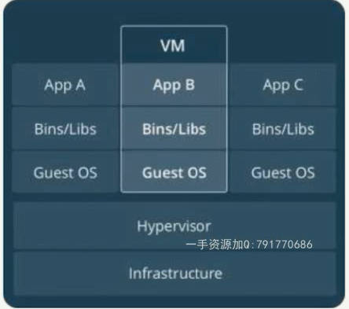

# Container Introduction

- [Container Introduction](#container-introduction)
  - [Docker installation](#docker-installation)

> 

容器的意义: 解决了开发和运维之间的沟通问题, container是一个标准, 类似集装箱

容器定义:
- 对软件和其依赖的标准化打包
- 应用之间相互隔离
- 共享一个os kernel
- 可以运行在多种OS上面

容器 vs 虚拟化
> 
> 
- 容器是APP层面的隔离
- 虚拟化是物理资源层面的隔离

虚拟化+容器:
> 

## Docker installation

check version:
- `docker --version`
- `sudo docker version`: more detail infomation

tip: 快速在virtualbox中创建inux虚拟机(需要提前安装好virtualbox)，采用[Vagrant](https://www.vagrantup.com/downloads.html)
- `vagrant --help`
- `vagrant init centos/7`: 会创建vagrantfile, 也可以google搜索vagrantfile for ubuntu18.04, 放到该目录
- `vagrant up`
- `vagrant ssh`: 直接进入了centos7的命令行
- `sudo yum update`
- `exit`
- `vagrant status`
- `vagrant halt`: power off centos
- `vagrant destroy`: delete centos

install docker in ubuntu
- `sudo apt-get remove docker docker-engine docker.io`
- `curl -fsSL https://download.docker.com/linux/ubuntu/gpg | sudo apt-key add -`
- `sudo add-apt-repository    "deb [arch=amd64] https://mirrors.tuna.tsinghua.edu.cn/docker-ce/linux/ubuntu \`
- `sudo apt-get install docker-ce`
- `sudo systemctl start docker`
- `sudo systemctl enable docker`
- `docker -v`
- `sudo docker info`
- `sudo docker images`
- `cd /etc/docker/`
- `sudo vim /etc/docker/daemon.json`
- `sudo systemctl restart docker`
- `sudo docker pull scrapinghub/splash`
- `sudo docker images`
- `sudo docker run -p 8050:8050 scrapinghub/splash`


```json
// /etc/docker/daemon.json
{
  "registry-mirrors": ["https://9cpn8tt6.mirror.aliyuncs.com"]
}
```

tip: 将上面命令写入vagrantfile可以自动安装完linux之后再安装docker

docker-machine: 一般docker for windows中自带有
- `docker-machine create demo`: 创建带docker的linux虚拟机(virtualbox提前安装)
- `docker-machine ls`: 列举virtualbox中的虚拟机
- `docker-machine ssh demo`: 进入linux
- `docker-machine stop demo`: power off linux
- `docker-machine start demo`: power on linux
- `docker-machine rm demo`: delete linux

tip1: 直接在远程运行docker
- `docker-machine start demo`
- `docker-machine ssh demo`
- `docker version`

tip2: 将远程的env弄到本地，然后本地的docker连接到远程的docker server
- `docker-machine env demo`
- `eval $(docker-machine env demo)`
- `docker version`

docker-machine在阿里云(余额>100)上面创建一个虚拟机然后再创建一个docker, [tutorial](https://github.com/AliyunContainerService/docker-machine-driver-aliyunecs)
- `docker-machine create -d aliyunecs --aliyunecs-access-key-id=<Your access key ID for the Aliyun ECS API> --aliyunecs-access-key-secret=<Your secret access key for the Aliyun ECS API>  --aliyunecs-region=<Region> demo`
- `docker-machine ls`
- `docker-machine ssh demo`: 进入远程界面
- `docker version`
- `exit`: 回到本地
- `docker-machine env demo`
- `eval $(docker-machine env demo)`: 本地管理远程的docker
- `docker version`
- `docker-machine env --unset`: 回到本地的env
- `docker version`

train docker: [docker playground](https://labs.play-with-docker.com/)